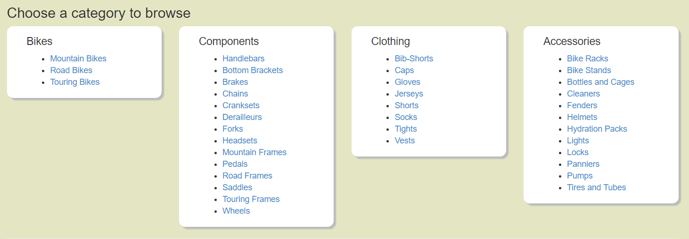
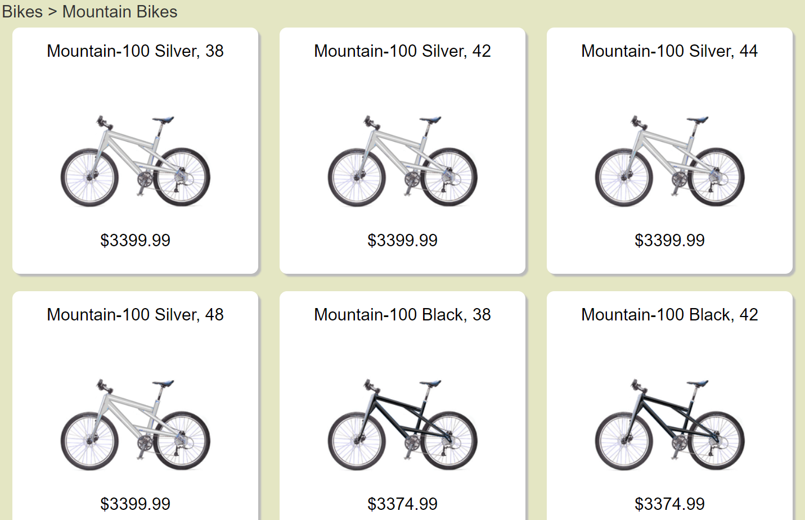
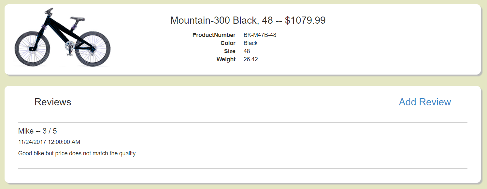
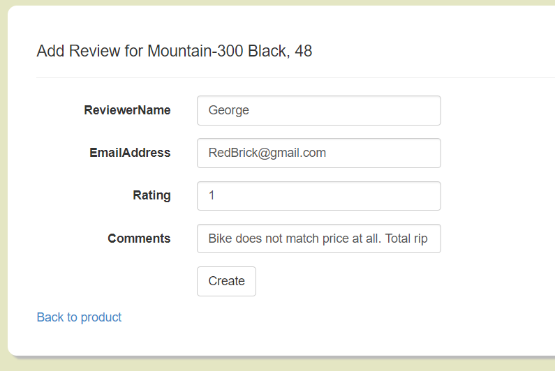
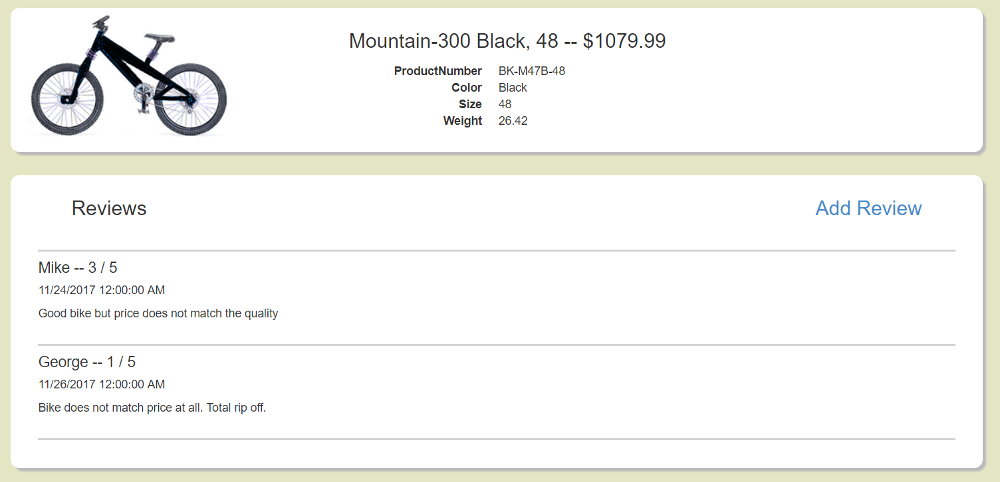

[Back](../cs460)

This assignment gave us the task of taking the AdventureWorks database from Microsoft and make a website to interact with the production subtree. We have to have a browse page sorted by category, a details page to view an individual product, and the ability to add a review to a product.
- The assignment page is [here](http://www.wou.edu/~morses/classes/cs46x/assignments/HW6.html).
- Repo containing the completed assignment is [here](https://bitbucket.org/blakebauer/cs460/).

Table of Contents:
+ [Category Selection](#category-selection)
+ [Browse](#browse)
+ [Details](#details)
+ [Add Review](#add-review)

### Category Selection
First, the user has to select the sub-category they wish to browse. Originally I had made two pages, one to select the category and then one to select the subcategory. After some thought, I decided that was lame and made it into one page.

 

A problem arose with this because the dbContext class was disposed of before the view was constructed so the category model class couldn't retrieve its subcategories. So, I made a view model for the Category class which takes a category, queries the subcategories and stores them both for use in the view.

```cs
public IEnumerable<ProductSubcategory> Subcategories;
public ProductCategory Category;

public CategoryVM(ProductCategory category)
{
  Category = category;
  Subcategories = category.ProductSubcategories.ToList();
}
```

This made the view nice and simple with a double razor foreach loop.

```html
@foreach (var c in Model)
{
  <h4>@c.Category.Name</h4>
  <ul>
    @foreach (var sc in c.Subcategories)
    {
      // ActionLink to Browse/Browse
    }
  </ul>
}
```

### Browse
After the use selects a subcategory it takes them to a list of products for that subcategory.



The action method is simple enough. It qureies the Subcategory, throws the category names into the viewbag, and sends subcategory.Products.ToList() to the view.

```cs
var subcategory = db.ProductSubcategories.Where(sc => sc.ProductSubcategoryID == subCategoryID).FirstOrDefault();
ViewBag.Subcategory = subcategory.Name;
ViewBag.Category = subcategory.ProductCategory.Name;
return View(subcategory.Products.ToList());
```

The view is simply a foreach loop making each product tile. 

```html
<h3>@ViewBag.Category > @ViewBag.Subcategory</h3>

<div class="container row">
  @foreach (var p in Model)
  {
    <div class="col-xs-6 col-sm-4">
      <div class="tile shadowbox">
        <a href="@Url.Action("Details", "Details", new { productID = p.ProductID })" class="tile-link">
          <div class="product-name">@p.Name</div>
          <div class="img-box"></div>
          <div class="product-price">$@p.ListPrice.ToString("0.00")</div>
        </a>
      </div>
    </div>
  }
</div>
```

To get the image from the database, there is a action method gets the image as a byte[] and returns a File object for it.

```cs
public ActionResult GetImage(int productID)
{
  using (ProductionContext db = new ProductionContext())
  {
    byte[] img = db.ProductProductPhotoes.Where(d => d.ProductID == productID).Select(m => m.ProductPhoto).FirstOrDefault().LargePhoto;
    return File(img, "image/png");
  }
}
```

To use the image we specific the `src` property of an `img` element with razor code `@Url.Action("GetImage", "Details", new { productID = p.ProductID })`.

### Details
Once the user has selected an item to view it opens a webpage with a few details about the item as well as any reviews left by other customers.



The view is typed with the Product model. It is a basic view with a foreach loop for the ProductReviews. Some of the code is below:

```html
<h3>@Model.Name  --  $@Model.ListPrice.ToString("0.00")</h3>
<dt>@Html.DisplayNameFor(model => model.ProductNumber)</dt>
<dd>@Html.DisplayFor(model => model.ProductNumber)</dd>
            
@foreach(var review in Model.ProductReviews)
{
  <div style="margin: 20pt; border-top: 2pt solid lightgray;">
    <h4>@review.ReviewerName -- @review.Rating / 5</h4>
    <h5>@review.ReviewDate</h5>
    <p>@review.Comments</p>
  </div>
}
```

The controller method is as expected although I found a work around for querying a property in the view. Since ProductReviews is an IEnumerable we can call toList on it and reassign it.

```cs
var product = db.Products.Where(p => p.ProductID == productID).FirstOrDefault();
product.ProductReviews = product.ProductReviews.ToList();
return View(product);
```

### Add Review
Finally if the user wants to add a review to the item they click add review and it takes them to the following page.



The view is a standard form but with a few extras.
The productid needs to be sent to the post. We can do that with a hidden input element. The back button is also different then usual.
```html
<input type="hidden" name="ProductID" value="@ViewBag.ProductID" />
@Html.ActionLink("Back to product", "Details", "Details", new { productID = ViewBag.ProductID }, new { })
```

The controller has two methods one for get and one for post. The get method is rather simple it gets the name of the product and throws it in the viewbag
```cs
using (ProductionContext db = new ProductionContext())
  ViewBag.ProductName = db.Products.Where(p => p.ProductID == productID).FirstOrDefault().Name;

ViewBag.ProductID = productID;
return View();
```

The post is normal but it has to set the ReviewDate and ModifiedDate because EntityFramework doesn't know they have default values in the database.
```cs
[HttpPost]
public ActionResult AddReview(ProductReview review)
{
  if (ModelState.IsValid)
  {
    using (ProductionContext db = new ProductionContext())
    {
      review.ReviewDate = DateTime.Today;
      review.ModifiedDate = DateTime.Today;
      db.ProductReviews.Add(review);
      db.SaveChanges();
    }
    return RedirectToAction("Details", new { productID = review.ProductID });
  }

  return View(review.ProductID);
}
```

And finally after its all filled out we can see the review on the details page:

