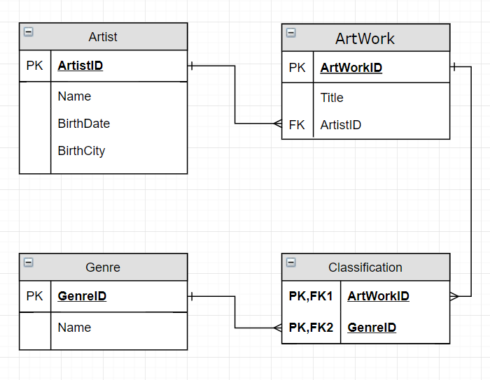
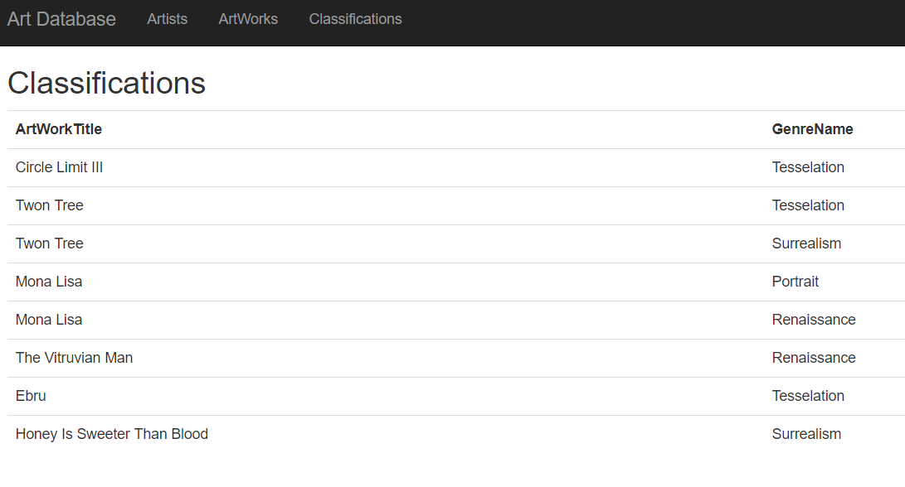
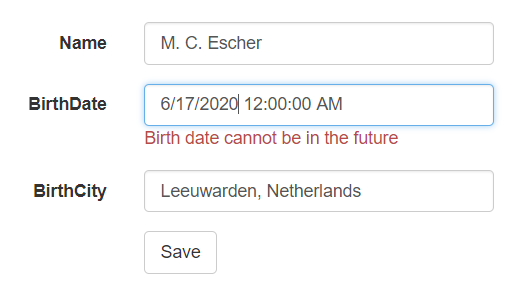
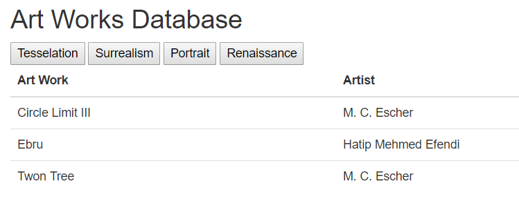

[Back](../cs460)

This assignment is practice for the final. It gives use a set of entities, we must design a database, create a set of webpages to interact with it, and then create a front webpage that uses ajax to dynamically load from the database.
- The assignment page is [here](http://www.wou.edu/~morses/classes/cs46x/assignments/HW8.html).
- Repo containing the completed assignment is [here](https://bitbucket.org/blakebauer/cs460/).

Table of Contents:
+ [Database](#database)
+ [Views](#views)
+ [AJAX](#ajax)

### Database

We are tasked with creating a database for a set of entities. Here is the ER diagram I came up with



The next step was to write a up script to initialize the database. Here is a section of the script the rest can be found [here](https://bitbucket.org/blakebauer/cs460/src/master/hw8/hw8/App_Data/up.sql?fileviewer=file-view-default).

```sql
CREATE TABLE dbo.ArtWorks (
  ArtWorkID		INT					IDENTITY (1,1) NOT NULL,
  Title		    NVARCHAR(128)		NOT NULL,
  ArtistID	    INT					NOT NULL,
  CONSTRAINT	[PK_ArtWork]		PRIMARY KEY CLUSTERED (ArtWorkID ASC),
  CONSTRAINT	[FK_ArtistArtWork]	FOREIGN KEY (ArtistID) REFERENCES Artists(ArtistID)
);

INSERT INTO dbo.ArtWorks (Title, ArtistID) VALUES
	('Circle Limit III', 1),
	('Twon Tree', 1),
	('Mona Lisa', 2),
	('The Vitruvian Man', 2),
	('Ebru', 3),
	('Honey Is Sweeter Than Blood', 4);
```

We were also required to make a down script which drops all the tables. Which must be done in this order.

```sql
drop table dbo.Classifications;
drop table dbo.Genres;
drop table dbo.ArtWorks;
drop table dbo.Artists;
```

### Views

Our next task was to make three list views which display Artists, Artwork, and Classifications. And put links to them in the navbar.

The Artist list has no relations so it is a very simple view. 
The ArtWork list however has a relation to Artist so we do a little C# before sending it to the view to make sure the Artists are loaded.
```cs
return View(db.ArtWorks.Include("Artist").ToList());
```

The include method on a dbset will load all the Artist properties so they can be used.
The Classification list is much more complicated due to how I made the classification table. To set this up I created a Classication View Model which contains the GenreName and the ArtWorkTitle. Then we construct the list of them to pass to the view.

```cs
List<ClassificationVM> classes = new List<ClassificationVM>();

var artworks = db.ArtWorks;
foreach(var artwork in artworks)
{
  var genres = artwork.Genres;
  foreach(var genre in genres)
  {
    classes.Add(new ClassificationVM {
      GenreName = genre.Name,
      ArtWorkTitle = artwork.Title
    });
  }
}

return View(classes);
```

There is possibly a easier way using the zip method or by using a double for loop in the view. But this method makes the view as simple as the Artist List.



We then had to make CRUD functionaility for the Artist. Which is mostly as simple as auto-generating them. But we were asked to modify the edit view to make all the fields required, limit the name field to 50 characters, and prevent the date from being in the future. I went ahead and applied the same to the create view as well.

To specify fields are required we add `required = "required"` to the editors:
```html
@Html.EditorFor(model => model.BirthDate, new { htmlAttributes = new { @class = "form-control", required = "required" } })
```

For the name character limit we add `maxlength = "50"`:
```html
@Html.EditorFor(model => model.Name, new { htmlAttributes = new { @class = "form-control", required = "required", maxlength = "50" } })
```

And for the date we have to go to the controller where we return them to the view with an error if the date is in the future.
```cs
if(artist.BirthDate > DateTime.Today)
{
  ModelState.AddModelError("BirthDate", "Birth date cannot be in the future");
  return View(artist);
}
```


### AJAX

Our last task was to add to the homepage buttons for each genre that when clicked dynamically load a table of all the artworks in the genre into a table below. The homepage view has a foreach to create the buttons and a script section.

```html
@foreach(var m in Model)
{
    <button onclick="loadGenre(@m.GenreID)">@m.Name</button>
}

@section Scripts {
    <script src="~/Scripts/GenreViewer.js"></script>    
}
```

The Controller method takes a genreid and constructs a list of anyomous objects consisting of the ArtWork title and the Artist Name. Then, it passes the list into the Json serializer and returns the JsonResult to the script.

```cs
List<object> stuff = new List<object>();
foreach(var artwork in db.Genres.Where(g => g.GenreID == genreID).FirstOrDefault().ArtWorks)
{
  stuff.Add(new {
    ArtWork = artwork.Title,
    Artist = artwork.Artist.Name
  });
}
return Json(stuff, JsonRequestBehavior.AllowGet);
```

Lastly, the script sends a ajax request to our controller with the genre id. Which when it is finished calls a method that ether gets the table or creates it, empties the table body, and fills it up with records.

```js
function loadGenre(id) {
  // Send ajax request
  var response = $.ajax({
    type: "GET",
    dataType: "json",
    url: "Home/GetArtWork",
    data: {
      genreID: id
    }
  }).done(function () {
    // Get table
    var works = $("#works");
    if (works.length == 0)
    {
      // If the table has not been initialized the create it
      works = $("body>div.container").append(`
        <table class="table" id=\"works\">
          <thead>
            <tr>
              <th scope="col">Art Work</ th>
              <th scope="col">Artist</ th>
            </ tr>
          </ thead>
          <tbody> </ tbody>
        </ table>
      `);
    }
    else
    {
      // If the table does exist grab it
      works = works[0];
    }
    
    // Get the body of the table
    var tbody = $("#works tbody");
    
    // Empty the body
    tbody.empty();
    
    // Fill the table up with records
    response.responseJSON.forEach(function (m, index) {
      tbody.append(`
        <tr>
          <td>` + m.ArtWork + `</td>
          <td>` + m.Artist + `</td>
        </ tr>
      `);
    });
  });
}
```

Which finally we get the following page.
