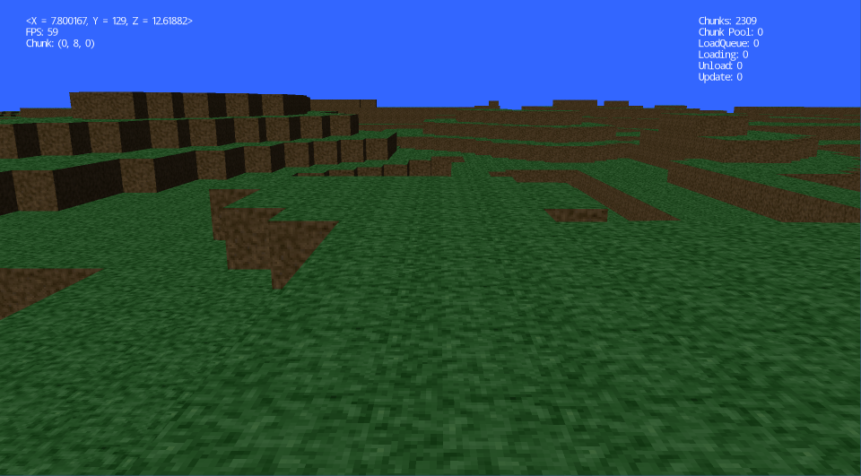
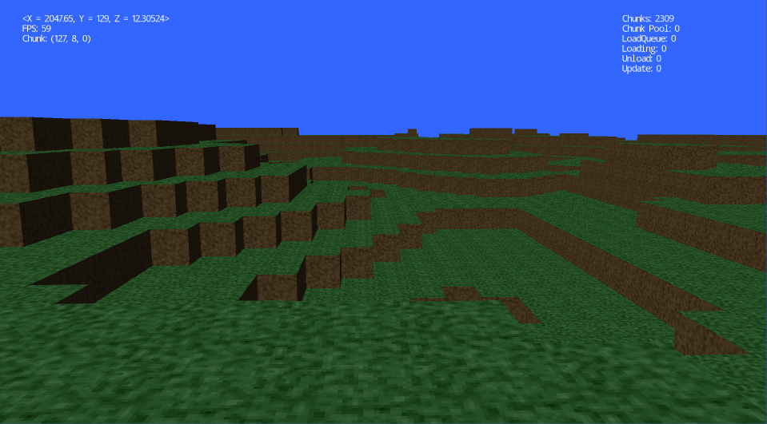
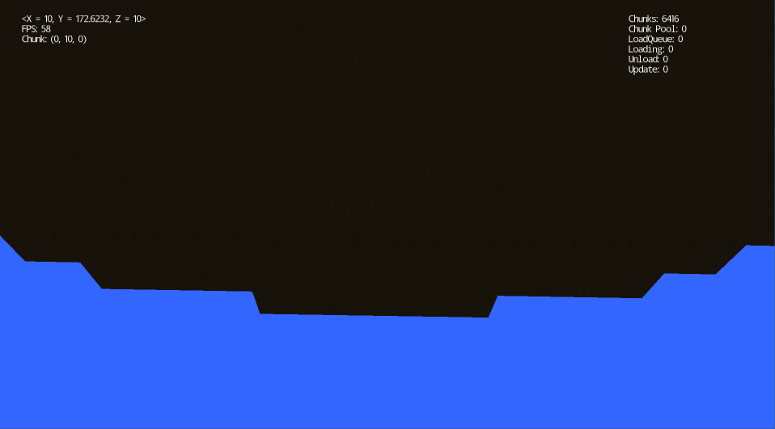
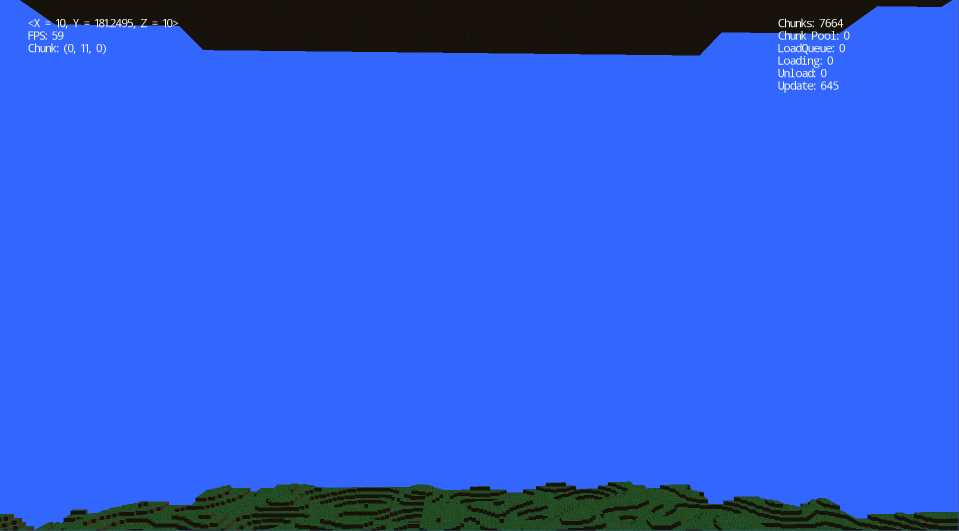

I started this project to give me something to do for a few weeks and to learn OpenGL. 

I wanted to make a world that would behave in one possible way an actual flat world would behave. Given, the it is a world of cubes I figured the world should be in a rectangular shape as well. So, in its current state the program creates and renders a world of cubes with a set size where the bounds on all 3 axes loop.

There were many challenges to be able to get this world to have any sort of efficiency. The first time I ran it, it ran at about 10 fps with only 1 chunk generated. So, one after another I added performance boosts and eventually reached a nice staple 60+ fps with _____ chunks loaded. Looking at CPU and GPU usages it is running just slightly less efficient than Minecraft.

Some of the commonly-known performance boosts that I implemented include: Frustum Culling, Object Pools, Multi-threading, Dirty Flags, and OpenGL Instancing. There were also tons of other performance boosts like culling faces between blocks.

This program is written in C# with OpenTK which I admit was a mistake because OpenTK had some memory leaks that took a while to fix (well work around) and some of OpenTK isn't concurrent friendly which again took some time to work around.

Here are a few pictures:

Looking at the picture above and comparing it to the one below one can see how the coordinates loop as the X coordinate goes from 7.8 to 2047 after moving forward a bit.

Here you can see the ceiling or the bottom of the world.

If the render distance is risen enough one can see both the ground and the bottom.

Its hard to demonstrate how the world can loop without a video at least in the Up/Down axis but just imagine if you dug a hole all the way down you would fall out of the ceiling and back down to the ground where your hole was dug potentially even landed in the hole and falling endlessly.

