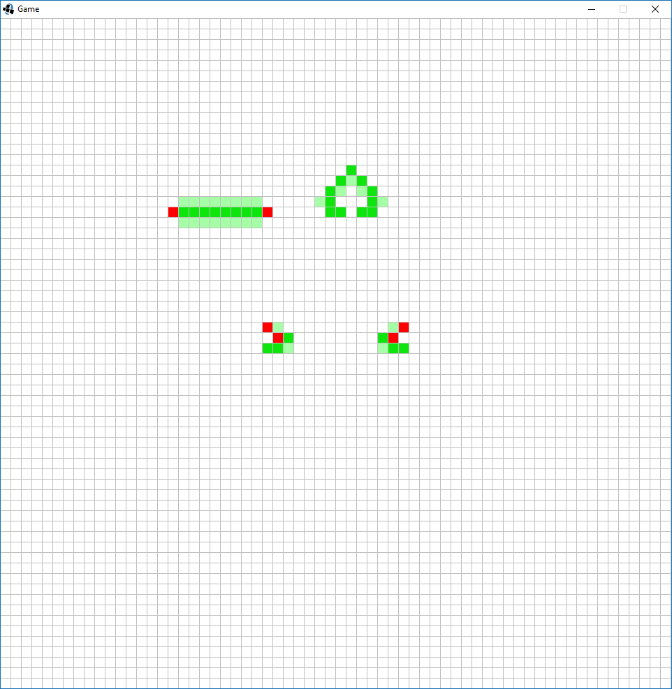

[GitHub](https://github.com/Starhide/JavaProjects/tree/master/GameOfLife)

A recreation of Conway's Game of Life in java. The green cells are live, faded green means they will activate on the next step, and red cells will die on the next step.

