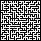
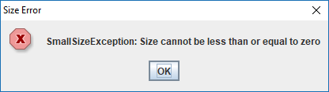
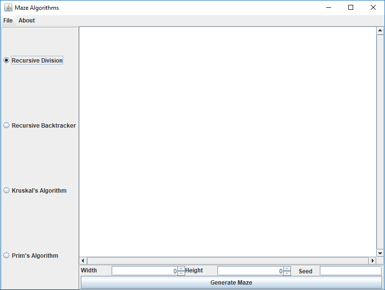
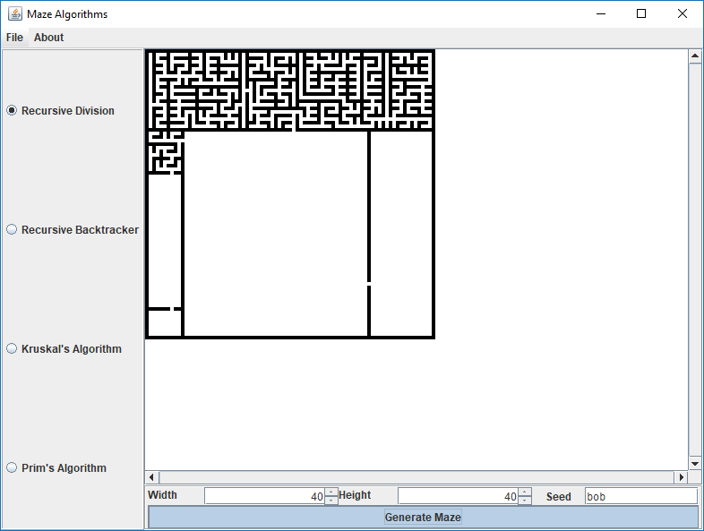
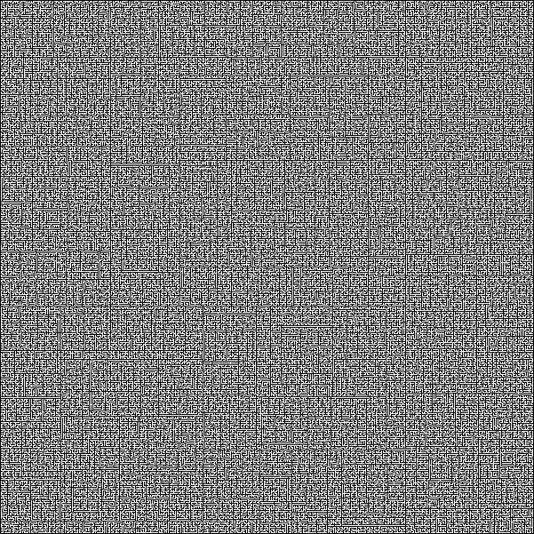

Made for the final project in CS162 this application generates a maze using one of four algorithms that can be selected by the user. Once a maze has been generated it can be exported to either a png or as plaintext. The application has an option for real time rendering, height and width of the maze, and the seed used by the random number generator.

This assignment was open-ended but had several requirements:
 + Must use OOP in some way i.e. have an abstract class and extend it in several child classes
 + Must use File I/O in some way
 + Had to have exception handling with a few custom exceptions 
 + It had to be a GUI using java swing


## OOP
The first requirement was to use an abstract class with at least 2 child classes that extend it.

For my application I decided to use MazeAlgorithm as my abstract class and my child classes will be the different algorithms that generate the maze.

MazeAlgorithm will handle some initial setup such as checking if the inputted width and height are reasonable and initializing the random number generate. It has one abstract method called generate.

This allows the main program to swap out which algorithm is generating the maze and not have to worry how it's doing it. 

The completed project contains for child classes:
+ Prims
+ Kruskals
+ Recursive Division
+ Recursive Back Tracker

Here is the Recursive Division's generate function
```java
public void generate(){
    for(int x = 0; x < width*2+1; x++){
        for(int y = 0; y < height*2+1; y++){
            if(x == 0 || x == width*2 || y == 0 || y == height*2)
                grid[x][y] = 1;
            else
                grid[x][y] = 0;
        }
    }
    split(1,1,width,height);
}

private void split(int x, int y, int w, int h){
    if(mazegui.realTime.getState())
            mazegui.renderMaze();
    
    if(w == 1 || h == 1){
        return;
    }
    int wall;
    int door;
    if(w > h){
        wall = rand.nextInt(w-1);
        door = rand.nextInt(h);
        for(int i = 0; i < h*2; i++){
            grid[x+wall*2+1][y+i] = 1;
            if(i == door*2)
                grid[x+wall*2+1][y+i] = 0;
        }
        split(x,y,wall+1,h);
        split(x+2*(wall+1),y,w-wall-1,h);
    }else {
        wall = rand.nextInt(h-1);
        door = rand.nextInt(w);
        for(int i = 0; i < w*2; i++){
            grid[x+i][y+wall*2+1] = 1;
            if(i == door*2)
                grid[x+i][y+wall*2+1] = 0;
        }
        split(x,y,w,wall+1);
        split(x,y+2*(wall+1),w,h-wall-1);
    }
}
```

## File I/O
The file I/O was rather simple. I was already drawing the maze to the screen so it was just a matter of saving that image. 

I also added the ability to export as plaintext. The maze was stored as an array of 0s and 1s so I just exported that to a txt file where 0s are open and 1s are walls.

Here is a 20x20 Kruskal Maze.



And here is that same maze as a txt file

```txt
20 x 20
1 1 1 1 1 1 1 1 1 1 1 1 1 1 1 1 1 1 1 1 1 1 1 1 1 1 1 1 1 1 1 1 1 1 1 1 1 1 1 1 1 
1 0 0 0 0 0 0 0 0 0 1 0 1 0 0 0 0 0 0 0 0 0 1 0 0 0 1 0 0 0 0 0 0 0 1 0 1 0 0 0 1 
1 0 1 0 1 1 1 1 1 1 1 0 1 1 1 1 1 1 1 0 1 1 1 0 1 1 1 1 1 0 1 0 1 1 1 0 1 1 1 0 1 
1 0 1 0 0 0 0 0 0 0 1 0 0 0 1 0 0 0 0 0 0 0 0 0 1 0 0 0 0 0 1 0 1 0 0 0 1 0 0 0 1 
1 1 1 0 1 0 1 0 1 0 1 1 1 0 1 0 1 1 1 0 1 1 1 0 1 1 1 0 1 0 1 1 1 0 1 0 1 0 1 0 1 
1 0 0 0 1 0 1 0 1 0 1 0 0 0 1 0 0 0 1 0 1 0 0 0 1 0 0 0 1 0 1 0 1 0 1 0 0 0 1 0 1 
1 1 1 0 1 1 1 0 1 1 1 1 1 0 1 0 1 0 1 1 1 1 1 0 1 1 1 0 1 1 1 0 1 0 1 1 1 1 1 1 1 
1 0 0 0 1 0 1 0 1 0 1 0 0 0 1 0 1 0 0 0 0 0 1 0 1 0 1 0 1 0 1 0 0 0 1 0 0 0 0 0 1 
1 1 1 0 1 0 1 1 1 0 1 0 1 0 1 0 1 1 1 0 1 1 1 1 1 0 1 0 1 0 1 1 1 0 1 0 1 1 1 1 1 
1 0 1 0 0 0 0 0 0 0 0 0 1 0 0 0 1 0 0 0 0 0 0 0 1 0 0 0 0 0 0 0 0 0 0 0 0 0 0 0 1 
1 0 1 0 1 1 1 1 1 1 1 1 1 0 1 0 1 1 1 1 1 0 1 0 1 0 1 0 1 0 1 1 1 1 1 1 1 1 1 0 1 
1 0 0 0 0 0 1 0 1 0 0 0 1 0 1 0 0 0 1 0 0 0 1 0 0 0 1 0 1 0 1 0 0 0 0 0 0 0 1 0 1 
1 1 1 0 1 1 1 0 1 1 1 0 1 1 1 1 1 1 1 1 1 0 1 1 1 0 1 0 1 1 1 1 1 0 1 1 1 0 1 0 1 
1 0 0 0 0 0 1 0 0 0 1 0 0 0 0 0 0 0 1 0 0 0 0 0 1 0 1 0 1 0 1 0 0 0 1 0 0 0 1 0 1 
1 1 1 0 1 0 1 0 1 0 1 0 1 1 1 1 1 1 1 1 1 0 1 1 1 0 1 0 1 0 1 1 1 0 1 0 1 1 1 1 1 
1 0 0 0 1 0 0 0 1 0 1 0 0 0 0 0 0 0 1 0 0 0 1 0 1 0 1 0 1 0 1 0 0 0 1 0 0 0 0 0 1 
1 1 1 0 1 1 1 0 1 1 1 1 1 0 1 1 1 1 1 0 1 0 1 0 1 0 1 0 1 0 1 0 1 1 1 1 1 0 1 1 1 
1 0 0 0 0 0 1 0 0 0 0 0 1 0 0 0 1 0 1 0 1 0 0 0 1 0 1 0 0 0 0 0 1 0 0 0 0 0 1 0 1 
1 1 1 1 1 1 1 0 1 1 1 0 1 1 1 0 1 0 1 1 1 0 1 1 1 0 1 0 1 1 1 0 1 1 1 1 1 0 1 0 1 
1 0 1 0 1 0 0 0 1 0 1 0 0 0 1 0 0 0 0 0 1 0 0 0 1 0 1 0 1 0 0 0 0 0 1 0 0 0 1 0 1 
1 0 1 0 1 1 1 1 1 0 1 1 1 0 1 0 1 0 1 0 1 0 1 1 1 1 1 1 1 0 1 0 1 0 1 0 1 1 1 0 1 
1 0 0 0 1 0 0 0 1 0 0 0 1 0 0 0 1 0 1 0 1 0 0 0 0 0 0 0 1 0 1 0 1 0 1 0 0 0 0 0 1 
1 0 1 1 1 0 1 1 1 1 1 0 1 0 1 0 1 1 1 0 1 0 1 0 1 0 1 0 1 1 1 0 1 0 1 1 1 1 1 0 1 
1 0 0 0 0 0 0 0 0 0 0 0 0 0 1 0 0 0 1 0 1 0 1 0 1 0 1 0 0 0 1 0 1 0 0 0 1 0 0 0 1 
1 1 1 0 1 0 1 1 1 1 1 1 1 1 1 1 1 0 1 0 1 0 1 0 1 1 1 0 1 1 1 0 1 1 1 1 1 0 1 1 1 
1 0 0 0 1 0 0 0 0 0 1 0 0 0 1 0 0 0 1 0 1 0 1 0 1 0 1 0 0 0 1 0 1 0 1 0 0 0 0 0 1 
1 0 1 0 1 1 1 0 1 1 1 1 1 0 1 1 1 0 1 1 1 0 1 1 1 0 1 1 1 1 1 1 1 0 1 0 1 0 1 1 1 
1 0 1 0 1 0 1 0 0 0 0 0 0 0 1 0 0 0 1 0 0 0 1 0 0 0 0 0 1 0 0 0 0 0 0 0 1 0 0 0 1 
1 0 1 1 1 0 1 0 1 0 1 1 1 1 1 0 1 1 1 1 1 1 1 0 1 1 1 0 1 0 1 1 1 0 1 0 1 1 1 0 1 
1 0 1 0 0 0 0 0 1 0 1 0 0 0 1 0 0 0 1 0 0 0 0 0 1 0 0 0 0 0 1 0 0 0 1 0 1 0 0 0 1 
1 1 1 0 1 0 1 1 1 0 1 1 1 0 1 1 1 0 1 1 1 0 1 1 1 1 1 0 1 1 1 0 1 1 1 0 1 0 1 0 1 
1 0 0 0 1 0 1 0 0 0 0 0 1 0 1 0 0 0 0 0 1 0 0 0 1 0 0 0 1 0 1 0 0 0 1 0 1 0 1 0 1 
1 1 1 0 1 0 1 0 1 0 1 1 1 0 1 1 1 0 1 1 1 0 1 1 1 1 1 1 1 0 1 0 1 1 1 1 1 1 1 1 1 
1 0 0 0 1 0 1 0 1 0 0 0 1 0 0 0 1 0 0 0 1 0 0 0 0 0 0 0 1 0 0 0 1 0 0 0 0 0 1 0 1 
1 0 1 1 1 0 1 0 1 1 1 0 1 0 1 1 1 0 1 1 1 0 1 0 1 0 1 1 1 1 1 0 1 0 1 0 1 0 1 0 1 
1 0 1 0 0 0 1 0 1 0 0 0 1 0 1 0 0 0 1 0 1 0 1 0 1 0 1 0 1 0 0 0 0 0 1 0 1 0 0 0 1 
1 1 1 0 1 1 1 0 1 1 1 0 1 0 1 1 1 1 1 0 1 1 1 0 1 1 1 0 1 1 1 0 1 1 1 0 1 1 1 1 1 
1 0 0 0 1 0 1 0 1 0 0 0 0 0 0 0 0 0 1 0 0 0 0 0 1 0 1 0 0 0 0 0 1 0 0 0 0 0 0 0 1 
1 0 1 1 1 0 1 1 1 0 1 1 1 0 1 1 1 1 1 0 1 1 1 0 1 0 1 0 1 0 1 1 1 0 1 0 1 0 1 1 1 
1 0 0 0 1 0 0 0 0 0 0 0 1 0 0 0 0 0 1 0 1 0 0 0 1 0 0 0 1 0 0 0 1 0 1 0 1 0 0 0 1 
1 1 1 1 1 1 1 1 1 1 1 1 1 1 1 1 1 1 1 1 1 1 1 1 1 1 1 1 1 1 1 1 1 1 1 1 1 1 1 1 1 
```

## Exception Handling

Coming up with exceptions for this project proved to be a challenge. I came up with two which are kind of pathetic but they meet the criteria.

When inputting the width and height for a maze if you go below 1 it throws a smallSizeException informing the user of the problem. If you go over 9000 then it throws a largeSizeException.



## GUI

Last we had to throw all this into a java swing gui with some number of little requirements such as a menu bar, button, etc. 



Here we have the gui. On the left you select the algorithm. On the bottom you specific the width, height, and seed. Then press the generate button and away it goes.



This is an in progress picture to show the real time element.


Here is a large 300x300 maze made with recursive division.
