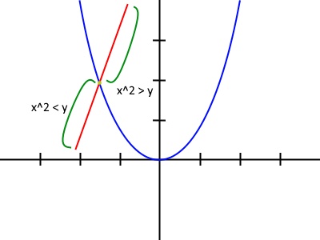
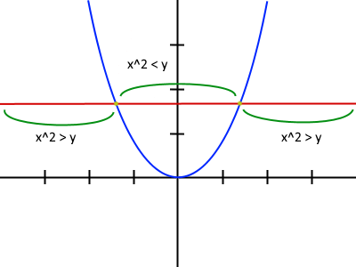
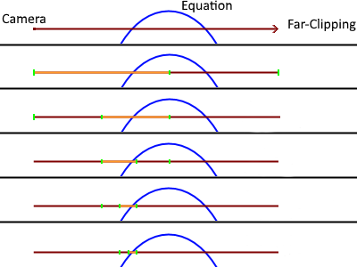
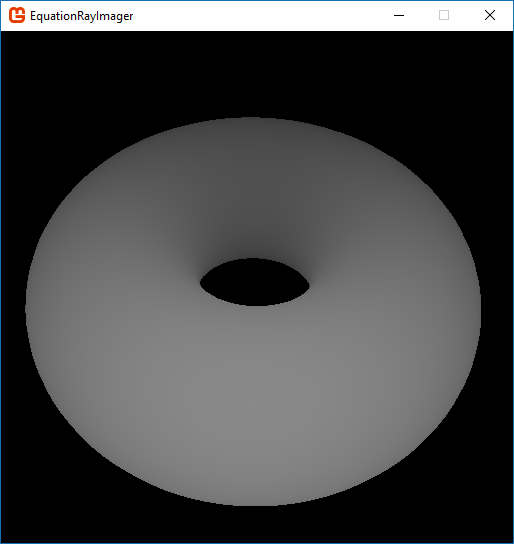
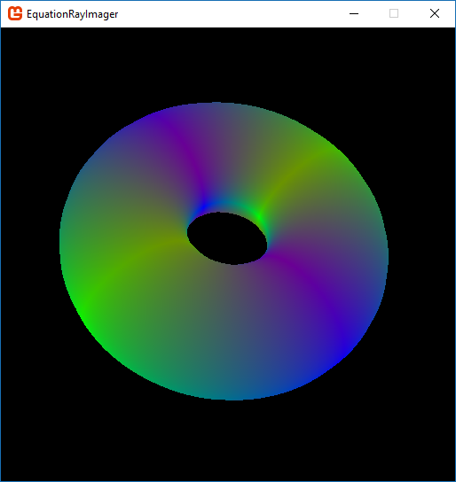
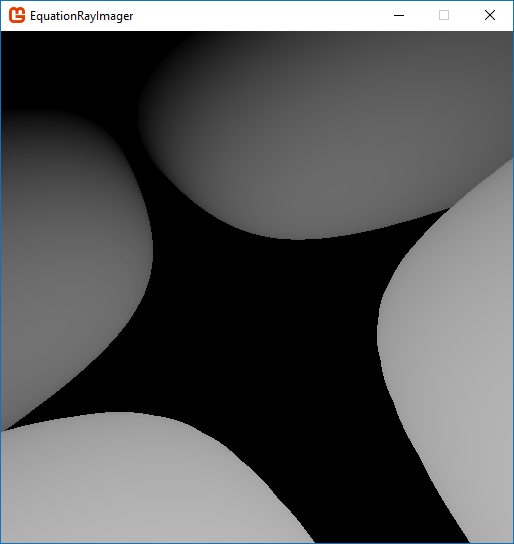
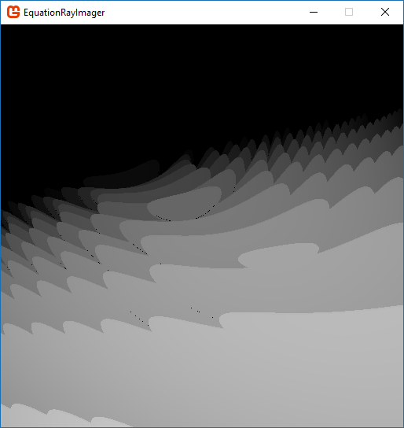

[GitHub Repo](https://github.com/Starhide/EquationRayCaster)

The general goal of this project was to be able to render any 3D equation real-time in a pixel perfect manner. 

The idea is to send a ray for each pixel on the screen and see if it intersects with the given equation. This will need to be done on the GPU in order to render it real-time. Luckily since each pixel calculation is independent of the others this can be easily done. There are a few ways to check if a ray intersects an equation most of which require complex algebraic calculations but there is one method that may be a bit expensive but is simple and will always work.

Requirements:
+ Done on the GPU; Each pixel is synchronously
+ Real-time
+ Any equation (Maybe even user inputted)
+ Pixel-Perfect

### Ray Casting

So, the plan for checking if the ray intersects the given equation. Say we have an equation x^2 = y. If we draw a line through it and travel across the line noting the x and y values along the way. We can notice that if x^2 is greater than y and then it becomes less than y, we intersect the equation. Here are some examples:

 

So, if we travel along a ray cast from the camera when we have a change in inequality then we have intersected the equation.

We know now how to determine if we've intersected a line. Now, we just have to walk the ray. I think the best way to do this is like binary search. So, we set a far clipping plane (a distance) we check at the beginning of the ray (the camera) and at the end, if we observe a change in inequality the we divide the ray into two segments and test again. We continue to do this until we found an set of coordinates the gets close to equality.

Now, there is one problem with this and thats if the ray might intersect multiple times causing the first point on the ray and the last to have the same direction of inequality. This happens on 'humps' like in a sine wave or at the bottom of a parabola. In order to partially correct this instead of splitting each segment into two we can split them in 10 or 50 (any number greater then 1). This will help with the accuracy but that is just one limitation to this easy method, it will never be 100% accurate.

Now, we plug it all into a wonderful good old language and bam! 

We have a torus. In this picture I am splitting each ray 50 times. The color is determined by the distance of the intersection / far clipping plane.

Here is another color scheme that lets one see the features a bit better.

Heres 1 = Sqrt(Abs(x * y)) - z^2

Unfortunately, almost any equation with a trig function has tearing issues or deformations when going a short distance away from the origin.

Another thing, currently the way the img is being drawn it is being transferred back and forth from the gpu to the ram which is slowing it down substantially which is why the resolution is small. 

After much attempts to get the CUDA library for C# (Alea, ILGPU) to work with DirectX or OpenGL without success I've established this project needs to be ported to C++ in order to increase performance anymore. I will revisit this later when I have the time. 

I might even attempt to use algebra to check for intersections in order to solve the sine wave problems.