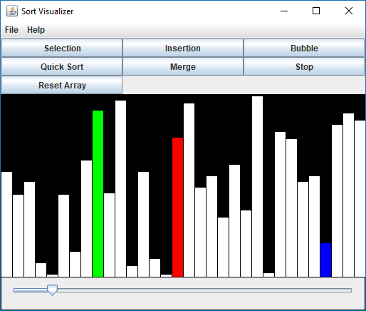

[GitHub](https://github.com/Starhide/JavaProjects/tree/master/SortVisualizer)

A simple java application for visualizing sorting algorithms. I used this as an exercise for a bit by reading about the sorting algorithm and then writing it myself. I may add more in the future.

Currently implemented sorting algorithms are:
+ Selection Sort
+ Insertion Sort
+ Bubble Sort
+ Quick Sort
+ Merge Sort

